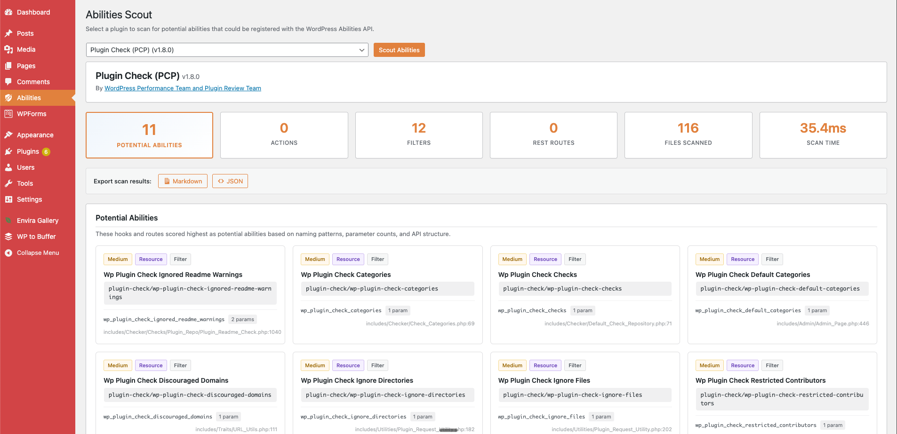
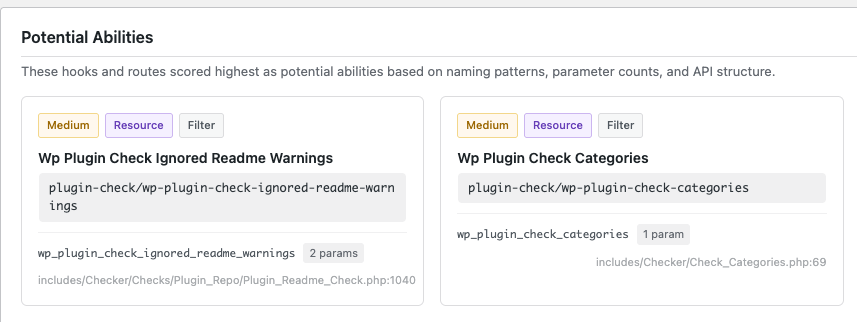
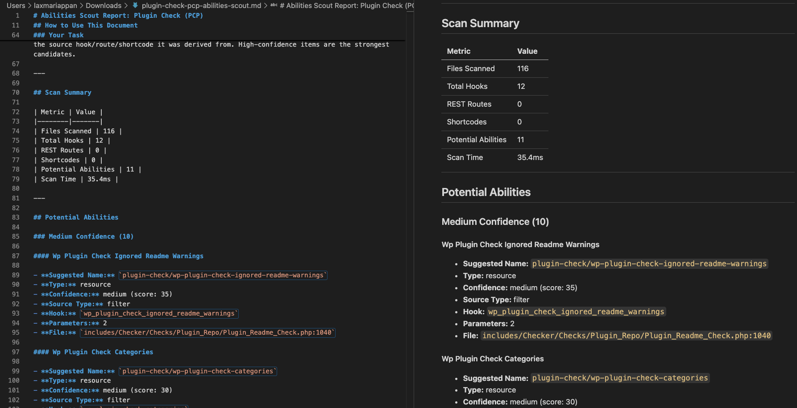
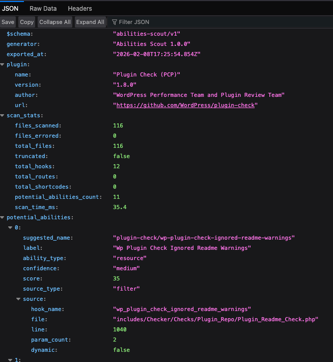

# Abilities Scout

Scan any installed WordPress plugin and discover potential abilities for the [Abilities API](https://developer.wordpress.org/apis/abilities/) (WP 6.9+).

One click. Static analysis. No code execution.

## What It Does

Abilities Scout uses PHP tokenization (`token_get_all()`) to read plugin source code and surface hooks, REST routes, and shortcodes that could become AI-callable abilities.

It then **scores every discovery** using a point-based classification engine:

- **REST routes** score highest — they're structured APIs already
- **Hooks with action verbs** (submit, create, delete, export...) score as tools
- **Hooks with data verbs** (get, list, check, query...) score as resources
- **Infrastructure plumbing** (nonces, enqueue, CSS) is filtered out

The result: a ranked list of potential abilities with suggested names, confidence levels, type classification (tool vs resource), and exact source locations.

## Export for AI Agents

After scanning, export results as **Markdown** or **JSON**.

The Markdown export is designed for AI agent consumption — it includes:

- The full `wp_register_ability()` registration pattern
- All required arguments (label, description, input/output schema, callbacks)
- Every discovered ability grouped by confidence
- Source hook names, file paths, and line numbers

Hand it to Claude, Cursor, or any AI coding tool and say *"build these abilities."*

| Markdown Export | JSON Export |
|:-:|:-:|
|  |  |

## Quick Start

1. Upload `abilities-scout` to `/wp-content/plugins/`
2. Activate the plugin
3. Go to **Abilities > Scout** in the admin menu
4. Select a plugin, click **Scout Abilities**

Works standalone or as a companion to [Abilities Explorer](https://github.com/developer-starter/abilitiesexplorer).

## Requirements

- WordPress 6.0+
- PHP 8.0+

## How Scoring Works

| Signal | Points | Why |
|--------|--------|-----|
| REST route | +50 | Already a structured API |
| Shortcode | +30 | Template-level ability |
| Action verb in hook name | +20 | Actionable functionality |
| Plugin-namespaced hook | +15 | Plugin's own API surface |
| 2+ parameters | +10 | Data transformation |
| 1 parameter | +5 | Data flow |
| Static hook name | +5 | Predictable, reliable |
| Infrastructure pattern | -30 | UI/admin plumbing |
| Dynamic hook name | -10 | Unpredictable at runtime |

**Confidence levels:** High (60+), Medium (30-59), Low (1-29)

## Example Results

**Akismet** — 22 files, 10ms:
- 6 high-confidence abilities (REST routes: alert, key, settings, stats, webhook)
- 17 medium-confidence abilities (submit spam, delete batch, comment check)

**WP Crontrol** — 11 files, 6ms:
- 12 medium-confidence abilities (schedule management, event editing)

**Plugin Check (PCP)** — 116 files, 35ms:
- 11 potential abilities (check categories, ignored warnings, restricted contributors)

## Safety

- **Read-only** — never modifies, executes, or includes scanned plugin code
- **Static analysis only** — uses PHP tokenization, not eval or reflection
- **Admin-only** — requires `manage_options` capability
- **No external calls** — everything runs locally, no data leaves your site

## Contributing

Found a bug? Have an idea? Contributions are welcome.

- **Report issues** — [Open an issue](https://github.com/laxmariappan/abilities-scout/issues) with your WP version, PHP version, and the plugin you scanned
- **Submit a PR** — Fork the repo, create a branch, and send a pull request
- **Suggest plugins to test** — If you find interesting results scanning a plugin, share them in an issue

See [CONTRIBUTING.md](CONTRIBUTING.md) for code standards and guidelines.

## Support the Project

If Abilities Scout is useful to you:

- ⭐ **Star this repo** — It helps others discover the project
- 📣 **Share it** — Post about it, mention it in a talk, or tell a fellow developer
- 🐛 **Open an issue** — Feature requests and bug reports both help improve the tool
- 🤝 **Contribute** — Code, docs, or testing — every bit counts

## License

GPL v2 or later. See [LICENSE](https://www.gnu.org/licenses/gpl-2.0.html).

---

Built by [Lax Mariappan](https://github.com/laxmariappan)
