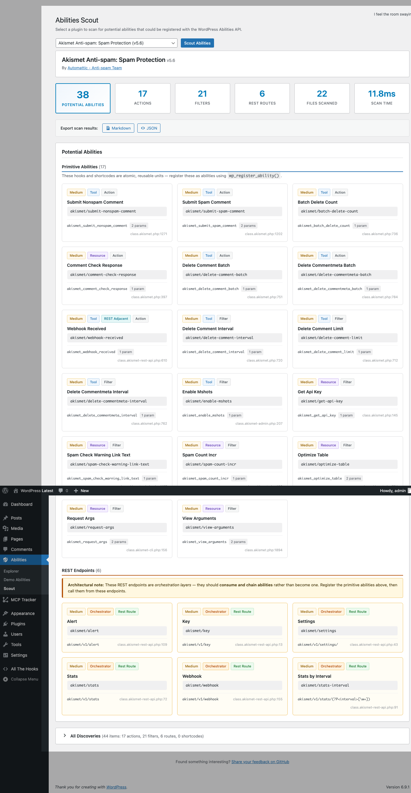
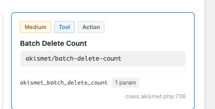
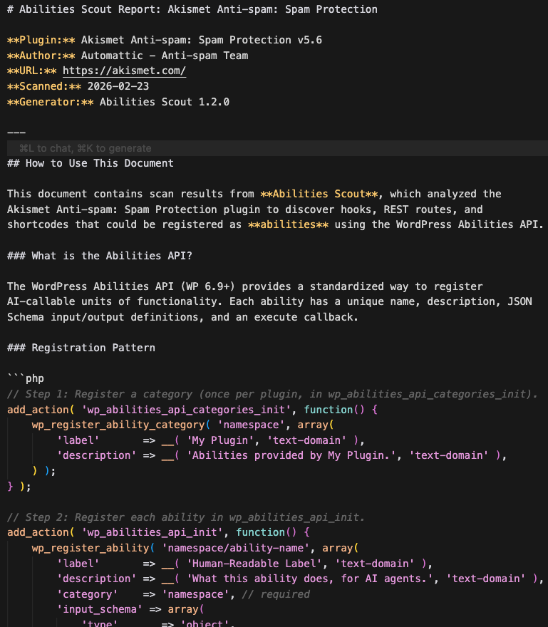
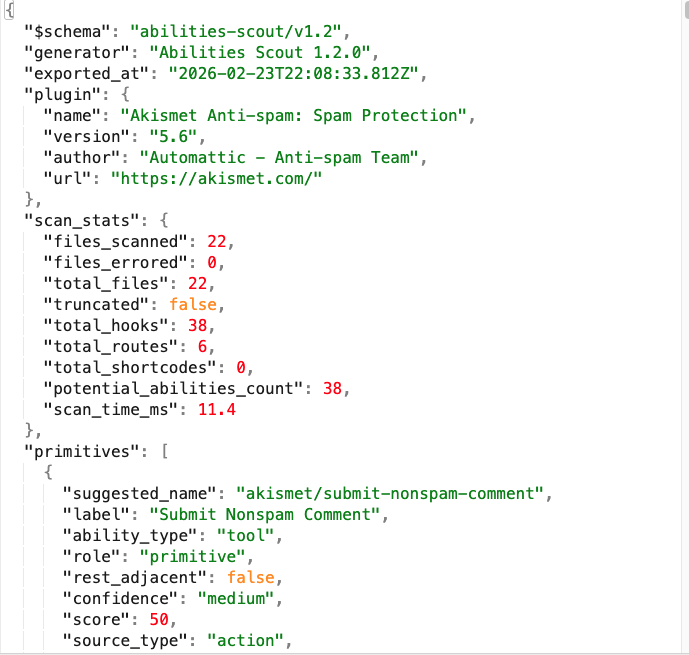

# Abilities Scout

Scan any installed WordPress plugin and discover potential abilities for the [Abilities API](https://developer.wordpress.org/apis/abilities/) (WP 6.9+).

One click. Static analysis. No code execution.



## What It Does

Abilities Scout uses PHP tokenization (`token_get_all()`) to read plugin source code and surface hooks, REST routes, and shortcodes that could become AI-callable abilities.

It then **scores every discovery** using a point-based classification engine:

- **Hooks and shortcodes score highest** as **primitive abilities** — atomic, reusable units that can be discovered, composed, and chained
- **REST routes are detected as orchestrators** — they should consume and chain abilities, not become them
- A **REST-adjacent bonus** boosts hooks found in the same file as REST route registrations, since those hooks are likely the primitives that REST endpoint already calls
- **Infrastructure plumbing** (nonces, enqueue, CSS) is filtered out

The result: a ranked list of potential abilities with suggested names, confidence levels, type classification (tool vs resource), and exact source locations.



## Using with AI Agents

Abilities Scout is designed for two distinct AI workflows. Understanding which one you're in changes how you use it.

### Path 1 — MCP (agentic, live site)

If your AI agent is connected to your WordPress site via the [Model Context Protocol](https://modelcontextprotocol.io/), Abilities Scout registers two abilities the agent can call directly:

| Ability | What it does |
|---------|--------------|
| `abilities-scout/scan` | Scans a plugin and returns structured results: primitives, orchestrators, confidence scores, source locations |
| `abilities-scout/draft` | Returns pre-formatted `wp_register_ability()` stubs for primitive abilities only |

**In a fully agentic flow, skip `draft` and act on `scan` directly.**

The agent already has the scan results — hook names, file paths, line numbers, roles. It can open those source files, read the actual function signatures, and write a complete, accurate implementation. Draft stubs are an extra hop that produces less context than reading the source.

```
AI agent → abilities-scout/scan → reads source files → writes real code
```

`abilities-scout/draft` is still useful as a **"show me before you touch anything"** gate — some workflows want the agent to surface what it would generate for human review before writing to disk.

### Path 2 — Export (offline, IDE-based)

When you're working in Claude.ai, Cursor, or any AI coding tool that isn't connected to your live site, use the export buttons after scanning:

- **Markdown export** — structured prose with primitives and orchestrators separated, `wp_register_ability()` stubs, source locations, and a "your task" summary. Paste directly into a chat or attach to a prompt.
- **JSON export** — machine-readable, schema-versioned (`abilities-scout/v1.2`), with `primitives[]` and `orchestrators[]` arrays. Feed to agents that consume structured tool output.

Hand either to an AI coding tool and say *"build these abilities."*

```
Export → paste to Claude / Cursor → AI writes code from stubs + context
```

The stubs carry the right semantics (hook name, schema shape, source location) so the AI has grounding even without live site access. The AI reformats to match your project's coding style.

| Markdown Export | JSON Export |
|:-:|:-:|
|  |  |

## Quick Start

1. Upload `abilities-scout` to `/wp-content/plugins/`
2. Activate the plugin
3. Go to **Abilities > Scout** in the admin menu
4. Select a plugin, click **Scout Abilities**

Works standalone or as a companion to [Abilities Explorer](https://github.com/developer-starter/abilitiesexplorer).

## Requirements

- WordPress 6.0+
- PHP 8.0+

## How Scoring Works

| Signal | Points | Why |
|--------|--------|-----|
| Hook: action verb in name | +20 | Actionable primitive |
| Hook: plugin-namespaced | +15 | Plugin's own API surface |
| Hook: 2+ parameters | +10 | Data transformation |
| Hook: 1 parameter | +5 | Data flow |
| Hook: static name | +5 | Predictable, reliable |
| Hook: REST-adjacent file | +20 | Likely consumed by a REST orchestrator |
| Hook: infrastructure pattern | -30 | UI/admin plumbing |
| Hook: dynamic name | -10 | Unpredictable at runtime |
| REST route (base) | +20 | Orchestration layer — should consume abilities |
| REST route: plugin-namespaced | +15 | Plugin's own endpoint |
| REST route: no regex params | +5 | Static endpoint |
| Shortcode | +30 | Template-level primitive |
| Shortcode: plugin-namespaced | +15 | Plugin's own shortcode |

**Confidence levels:** High (60+), Medium (30–59), Low (1–29)

REST routes max out at 40 (medium) by design — they are orchestrators, not primitives.

## Abilities as Primitives

The WordPress Abilities API is designed for **composability**. Abilities work best as small, atomic units — primitives that can be discovered, composed, and chained by AI agents and other tools.

**REST endpoints are orchestrators.** They receive HTTP requests, coordinate multiple operations, and return structured responses. The right pattern is:

```
REST endpoint → calls/chains → wp_register_ability() primitives
```

Abilities Scout reflects this by:

- **Scoring hooks and shortcodes higher** — these are your primitive candidates
- **Flagging REST endpoints as orchestrators** — with a recommendation to consume abilities rather than become them
- **Surfacing REST-adjacent hooks** — hooks found in the same file as REST route registrations score an extra +20 because they're likely the primitives that REST endpoint already calls

The exported Markdown separates **Primitive Abilities** from **REST Orchestrators**, making it clear to AI agents what to register vs. what to refactor.

## Example Results

**Akismet** — 22 files, 10ms:
- Medium-confidence REST orchestrators (alert, key, settings, stats, webhook endpoints)
- 17 medium-confidence primitive abilities (submit spam, delete batch, comment check hooks)

**WP Crontrol** — 11 files, 6ms:
- 12 medium-confidence primitive abilities (schedule management, event editing hooks)

**Plugin Check (PCP)** — 116 files, 35ms:
- 11 potential abilities (check categories, ignored warnings, restricted contributors)

## Safety

- **Read-only** — never modifies, executes, or includes scanned plugin code
- **Static analysis only** — uses PHP tokenization, not eval or reflection
- **Admin-only** — requires `manage_options` capability
- **No external calls** — everything runs locally, no data leaves your site

## Contributing

Found a bug? Have an idea? Contributions are welcome.

- **Report issues** — [Open an issue](https://github.com/laxmariappan/abilities-scout/issues) with your WP version, PHP version, and the plugin you scanned
- **Submit a PR** — Fork the repo, create a branch, and send a pull request
- **Suggest plugins to test** — If you find interesting results scanning a plugin, share them in an issue

See [CONTRIBUTING.md](CONTRIBUTING.md) for code standards and guidelines.

## Support the Project

If Abilities Scout is useful to you:

- ⭐ **Star this repo** — It helps others discover the project
- 📣 **Share it** — Post about it, mention it in a talk, or tell a fellow developer
- 🐛 **Open an issue** — Feature requests and bug reports both help improve the tool
- 🤝 **Contribute** — Code, docs, or testing — every bit counts

## License

GPL v2 or later. See [LICENSE](https://www.gnu.org/licenses/gpl-2.0.html).

---

Built by [Lax Mariappan](https://github.com/laxmariappan)
